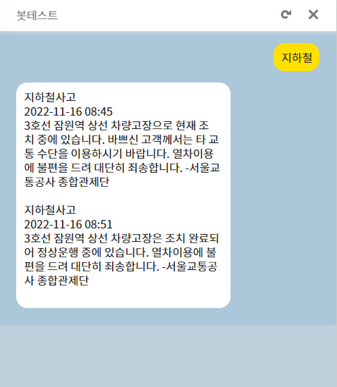
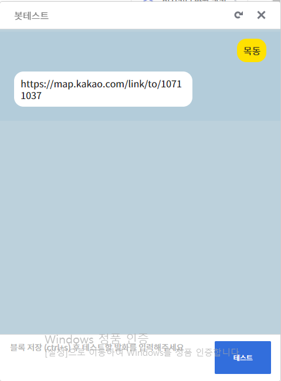
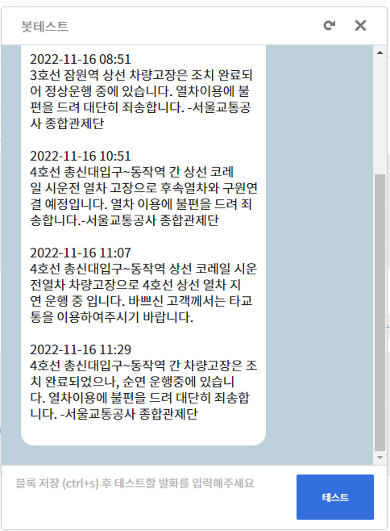
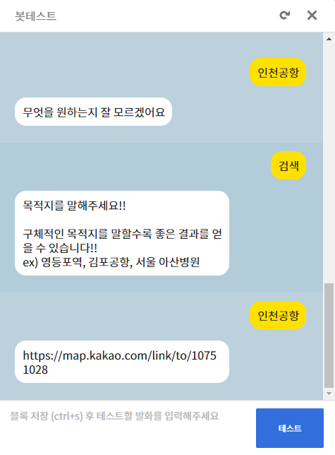
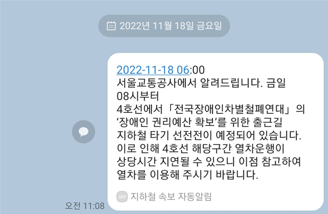
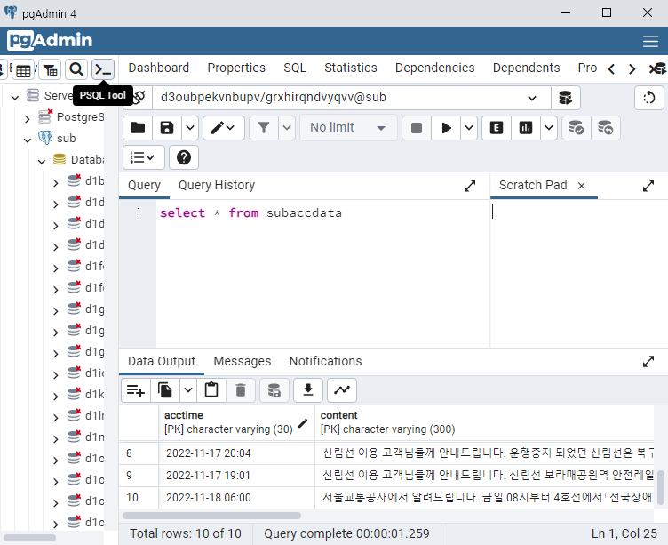
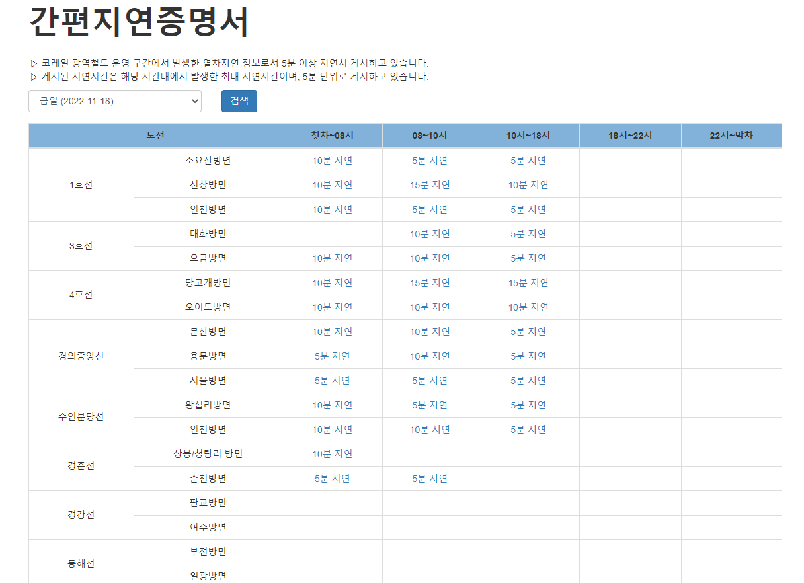

# 2022.11.15

1. 서울안전누리 사이트 크롤링
 

2. 서울 안전누리 사이트에서 데이터 긁어 오기

3. 긁어온 데이터 DB에 담기

4. '지하철' 입력시 최신 사건사고 나오게 하는 시나리오 짜기.

5. 결과  
<!--  -->
 

# 2022.11.16

1.  지하철 시간별 단락 구분하기

어제 결과 사진과 다르게 시간별 단락을 구분했다.  
<!--  -->

  
2. 카카오 API 활용하여 목적지 알려주기.  
<!--  -->

 원하는 장소 검색시 위처럼 카카오링크로 대답.

3. 실시간으로 추가되는 정보들을 중복되지 않게 중복검사.
    - 2개의 컬럼을 가지는 subaccdata를 새로 만듬.
    - 새로 만든 데이터베이스의 컬럼 2개를 복합키로 설정.
        + 이떄 postgre 에서 중복된 데이터를 사전에 예방하여 insert하려면 기본 키가 설정되어야 함.
    - 기존에 있던 subdata 테이블의 데이터를 subaccdata로 옮김.
    - 변경된 테이블에 맞는 insert 코드 세팅
- 결과  
<!--  --> 

# 2022.11.17

1. 카카오 경로찾기 컨테스트 구현 (황지훈)
    - '목적지', '경로' 등의 발화를 통해 사용자가 원하는 목적지를 입력.
    <!--  -->
- 결과  
 

# 2022.11.18

1. 카카오 api 이용하여 나에게 메시지 보내기 (황지훈)
<!--  -->
    셀레레움 크롤링 통해 지하철 속보 나에게 보내기
 

2. 네이버 뉴스 크롤링후 뉴스 출력 (임여명)
    - 원하는 호선 뉴스 출력
<!--  -->
 

3. 지하철 간편지연증명서 출력 (임여명)
    - 열차 호선, 열차 방면, 지연된 시간, 운행시간을 입력하면 간편지연증명서 링크출력
<!-- ,  -->

4. 일정 시간마다 자동으로 DB에 넣고 속보 알림 구현(황지훈)
    - data1 = 10분마다 오늘 날짜 지하철 속보 크롤링
    - data2 = DB에서 오늘 날짜 지하철 속보 가져옴
        - data1 과 data2 가 다르다면 자동으로 DB에 insert하고 카톡 알림 기능
    - 결과 
    <!-- ,  -->
    

5. 10분마다 제목과 링크가 중복된 기사를 제외하고 1호선 ~ 9호선의 네이버 뉴스를 각각 10개 씩 90개를 자동으로 크롤링하여 DB에 insert 시키는 프로그램 구현 (임여명)
<!-- ,  --> 

6. 간편지연증명서의 기존 사이트의 경후 5,6,7,8,9호선이 없어 다른 링크 사이트 추가. (임여명)
<!-- ,  -->

# 다음주 할일
1. 최종 ppt 작성
2. 뉴스검색, 간편지연증명서 코드 수정