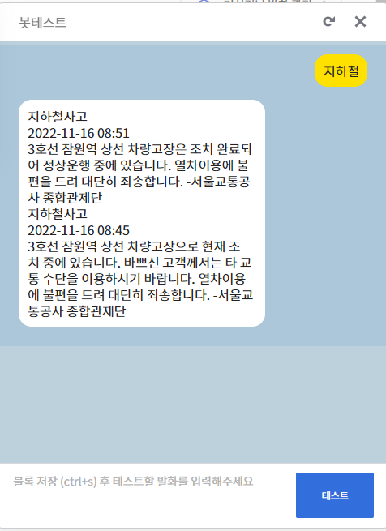

### 22.11.15 ~ 
## To Do List:
# 2022.11.15

1. 서울안전누리 사이트 크롤링
 

2. 서울 안전누리 사이트에서 데이터 긁어 오기

3. 긁어온 데이터 DB에 담기

4. '지하철' 입력시 최신 사건사고 나오게 하는 시나리오 짜기.

5. 결과  
<!--  -->
 

# 2022.11.15 오늘 코딩의 문제점.
결과 사진을 보면 알 수 있듯이, 지하철 시간별 단락이 구분되어 있지 않아서 가독성이 떨어진다.

# 내일 해야할 것 .
1. 네이버 API 활용하여 뉴스 기사 DB에 저장하기
2. 카카오 API 활용하여 목적지 알려주기.
3. 결과의 문제점 해결 방안 찾고 해결해보기.

