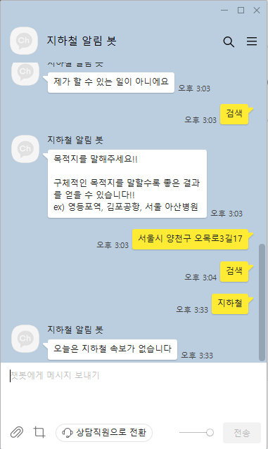

### 2022.11.17
## todolist

1. 카카오 경로찾기 컨테스트 구현 (황지훈)
    - '목적지', '경로' 등의 발화를 통해 사용자가 원하는 목적지를 입력.
    <!--  -->
- 결과  
 

# 추가하고 싶은 내용
1. 오늘과 같이 지하철 사고내용이 없는경우   
처럼 나와 챗봇이 길찾기만 가능
- 이럴때 지하철 도착정보 검색기능을 추가하여 사용도 증가

# 내일 해야할 일
1. 지하철 속보 자동 알리미
2. 네이버 api 등록
