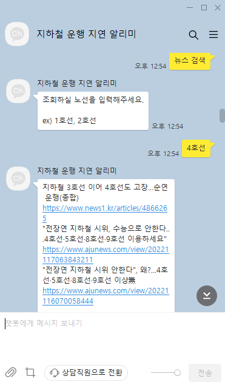
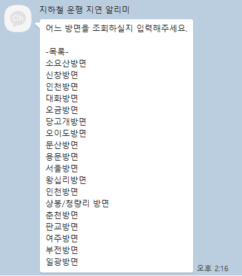
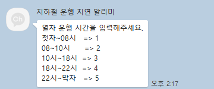
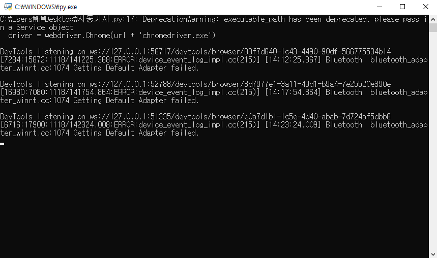
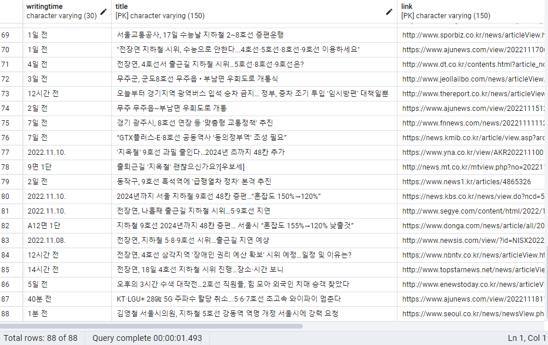
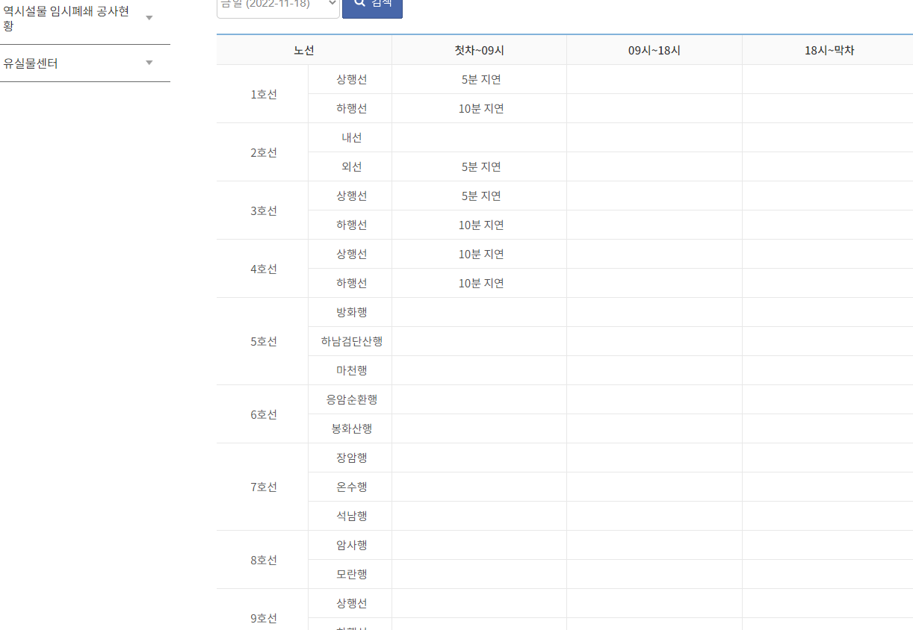

### 2022.11.18
## todolist

1. 카카오 api 이용하여 나에게 메시지 보내기 (황지훈)
<!--  -->
    셀레레움 크롤링 통해 지하철 속보 나에게 보내기
 

2. 네이버 뉴스 크롤링후 뉴스 출력 (임여명)
    - 원하는 호선 뉴스 출력
<!--  -->
 

3. 지하철 간편지연증명서 출력 (임여명)
    - 열차 호선, 열차 방면, 지연된 시간, 운행시간을 입력하면 간편지연증명서 링크출력
<!-- ,  -->

4. 일정 시간마다 자동으로 DB에 넣고 속보 알림 구현(황지훈)
    - data1 = 10분마다 오늘 날짜 지하철 속보 크롤링
    - data2 = DB에서 오늘 날짜 지하철 속보 가져옴
        - data1 과 data2 가 다르다면 자동으로 DB에 insert하고 카톡 알림 기능
    - 결과 
    <!-- ,  -->
    

5. 10분마다 제목과 링크가 중복된 기사를 제외하고 1호선 ~ 9호선의 네이버 뉴스를 각각 10개 씩 90개를 자동으로 크롤링하여 DB에 insert 시키는 프로그램 구현 (임여명)
<!-- ,  --> 

6. 간편지연증명서의 기존 사이트의 경후 5,6,7,8,9호선이 없어 다른 링크 사이트 추가. (임여명)
<!-- ,  -->

# 오늘 코딩의 한계점
1. 카카오 앱을통해 메세지를 보내는것은 실행했으나, 챗봇으로 하려면 비즈니스 인증이 필요
2. 뉴스데이터를 DB에 넣고 호선 입력을 통해 조회하는 방식이라 뉴스 작성시간을 실시간으로 볼 수 없음.
3. 뉴스 출력시 DB에 저장된 뉴스중 3개의 뉴스만 출력하게 해 놨으나, 최신순으로 나열하는 방법 필요.
4. 간편지연증명서 출력시 링크 파라미터를 수정하여 보내주는 방식이라, 이용자가 지연시간을 조작 할 수 있음.(해결방안 필요!)
5. db 갱신이 일어날때마다 카톡알림을 보내려면 메시지 API토큰 갱신 필요!
6. 지하철 속보가 갱신될때도 돌아가는지 테스트 => 주말이나 오후에도 한번더 확인!

