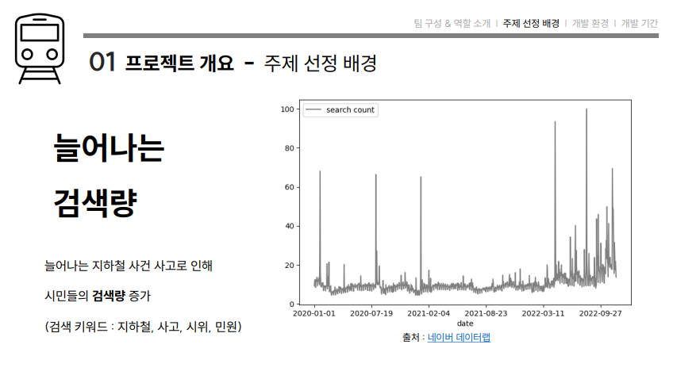

# 지하철 교통 도우미 챗봇
## 목표
- 지하철 사건 사고에 대한 정보를 실시간으로 받아와 챗봇으로 알려주는 프로그램을 만들어 불편함을 줄여줍니다.

## 주제 선정 배경
- 우리나라 지하철 일 이용자의 수는 일 평균 700만 이상인데, 이처럼 중요한 출퇴근 수단인 지하철에 최근 자주 발생하는 전장연 지하철 시위나, 무궁화호 이탈 사건등으로 바쁜 출근시간 지하철 이용자들의 불편함과 스트레스를 줄여보고자 위 프로그램을 기획하게 되었습니다.

# 설명
## 팀원 : 임여명 , 황지훈 , 한유경
### 프로잭트 개발 환경
#### DATABASE
 - PostgerSQL - 14.5
     - 오픈 소스 객체-관계형 데이터베이스 시스템으로 다른 관계형 데이터베이스 시스템과 달리 다양한 데이터베이스 객체를 사용자가 임의로 만들 수 있는 기능을 제공한다.
- PgAdmin4 - 6.15
    - PostgerSQL을 보다 쉽게 관리하게 GUI 환경을 제공해주는 툴.
#### WEBSERVER
 - Heroku - 7.53.0
     - 클라우드 기반의 어플리케이션 플랫폼으로 github를 지원해 준다.
#### 사용 언어
 - Python - 3.10.7
####  사용한 Library
  - Falsk - 2.2.2
  - Psycopg2 - 2.9.5
  - Selenium - 4.6.0
  - Schedule - 1.1.0
    
### Tool
- Kakao I open builder
    - KaKao I : 카카오의 통합 인공지는 플랫폼
    - KaKao I open bulider : 누구나 사용할 수 있는 KaKao I 개발플랫폼

## 준비기간 : 2022.11.18 ~ 2022.12.02
